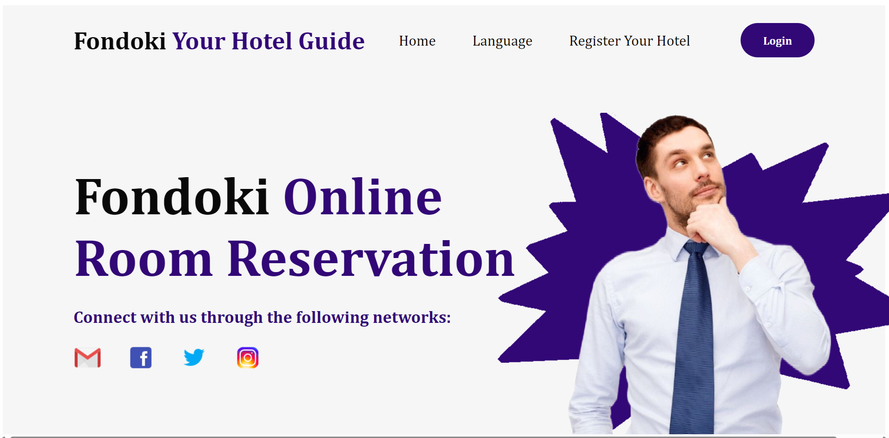

# Fondoki - Multi-Accommodation & Hotel Management Dashboard

**Fondoki** is a comprehensive, responsive Hotel Management System (HMS) and reception desk ecosystem designed to streamline hotel operations, track real-time room inventories, and manage guest lifecycles seamlessly. 

While currently optimized with live database templates for *Hotel Kerdada*, the platform is structurally engineered to scale across multiple registered hotel properties.

---

## 🚀 Core Platform Modules & Windows

### 1. Reception Desk Dashboard (`pagFondoki.php`)
* Acts as the main command center for hotel receptionists.
* Features live dynamic counters fetching real-time room availability based on current-date server state metrics.
* Offers direct navigation to specialized room management ledgers and general inventory lookups.

### 2. Smart Booking & Reservation Matrix (`chambre.php`, `chambr2.php`, `chambr3.php`)
* Dedicated control windows for managing **Single**, **Double**, and **Triple** occupancy rooms.
* Integrated with a strict mathematical algorithmic calendar query that prevents double-bookings or overlapping guest timelines.
* Automated color-coded warning systems alerting staff of checking-out guests when time remaining hits critical thresholds ($\le 1$ Day).

### 3. Rooms Inventory Management (`list_ch.php`)
* A master layout displaying the comprehensive hotel database architecture.
* Tracks specific room assets, fixed price rates, and overarching hotel capacity setups.

### 4. Multi-Hotel Registration & Scalability Control
* Prepared navigation hooks (`Register Hotel`, `Settings`) built to accommodate structural expansion, allowing future third-party hotel property onboarding onto the Fondoki network guide.

### 5. Integrated Support Desk Module
* Connects frontend operators directly to the platform's utility technical support channels (Inbound phone lines, email desks, social channels).

---

## 🛠️ Tech Stack & Security Framework
* **Frontend:** Clean Semantic HTML5, CSS3 Component Architecture, Responsive Layout Viewports, Dynamic Native JavaScript (`date.js`).
* **Backend:** Native PHP (Procedural & OOP DB Interaction logic).
* **Database Management:** MySQL relational structures.
* **Security Layer:** Robust SQL Injection protection implemented using **Prepared Statements** (`$conn->prepare()`) and parameter binding for all dynamic guest payloads.

---

## 💻 Local Installation & Setup Guide

### Prerequisites
Ensure you have a local server deployment stack installed, such as **XAMPP** or **WAMP**.

### Step-by-Step Deployment
1. Clone this repository into your server deployment root folder (e.g., `C:/xampp/htdocs/`):
   ```bash
   git clone [https://github.com/YOUR_USERNAME/Fondoki-Hotel-Management.git](https://github.com/YOUR_USERNAME/Fondoki-Hotel-Management.git)